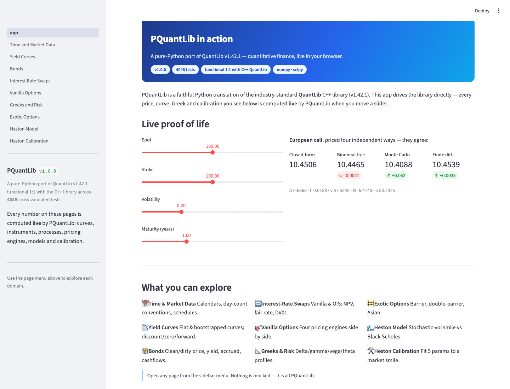
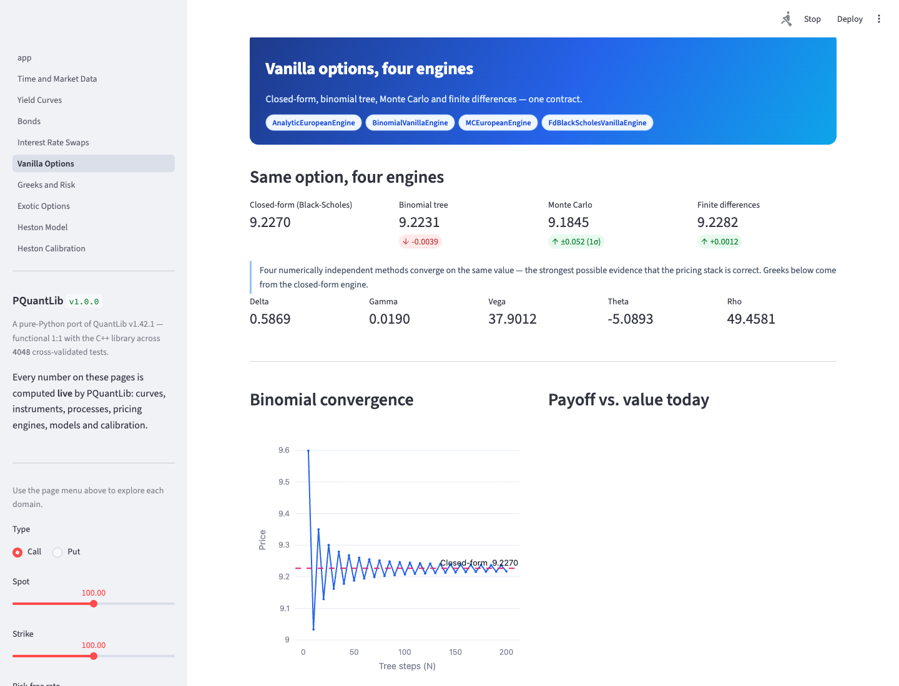
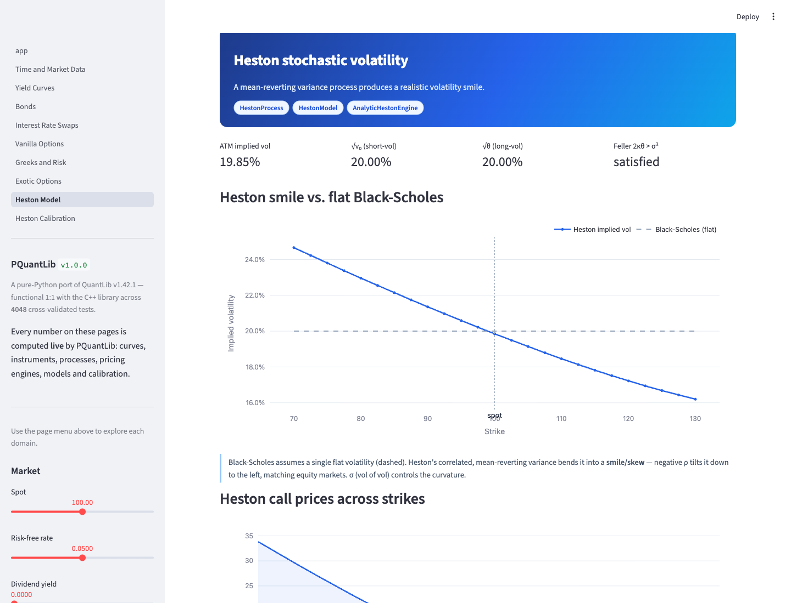

# PQuantLib Showcase

An interactive **Streamlit** web app that drives the [PQuantLib](../pquantlib) library
— a pure-Python port of QuantLib v1.42.1 — live in your browser. Move a slider, and a
real pricing engine recomputes the answer. Nothing is mocked.

> Every curve, price, Greek, smile and calibration on every page is produced by
> PQuantLib at request time.

## Quick start

This is a member of the PQuantLib **uv workspace**, so it shares the repo-root
virtualenv and resolves `pquantlib` directly — no separate install. Run everything
from the workspace root (`pquantlib/`):

```bash
uv sync                                            # sets up the whole workspace, incl. this demo
uv run streamlit run pquantlib-showcase/app.py     # opens http://localhost:8501
```

Requires Python 3.14 (same as PQuantLib). The core `pquantlib` *library* package does
not depend on this app — only the dev workspace env pulls in streamlit/plotly/pandas.

## A look at it

| Landing — four engines agree live | Vanilla options + convergence | Heston volatility smile |
|---|---|---|
|  |  |  |

## What it demonstrates

| Page | PQuantLib surface exercised |
|------|------------------------------|
| **Time & Market Data** | `time` — calendars, business-day adjustment, day-count conventions, schedule generation |
| **Yield Curves** | `FlatForward`, `PiecewiseYieldCurve` bootstrapped from `DepositRateHelper`s; discount / zero / forward |
| **Bonds** | `FixedRateBond` + `DiscountingBondEngine` — clean/dirty price, YTM, accrued, cashflows, DV01 |
| **Interest-Rate Swaps** | `VanillaSwap` & `OvernightIndexedSwap` + `DiscountingSwapEngine` — NPV, par rate, DV01 |
| **Vanilla Options** | One European option priced **four ways**: `AnalyticEuropeanEngine`, `BinomialVanillaEngine`, `MCEuropeanEngine`, `FdBlackScholesVanillaEngine` |
| **Greeks & Risk** | Delta/gamma/vega/theta profiles across spot; `implied_volatility` inversion |
| **Exotic Options** | `BarrierOption`, `DoubleBarrierOption`, geometric `DiscreteAveragingAsianOption` + analytic engines |
| **Heston Model** | `HestonProcess` / `HestonModel` / `AnalyticHestonEngine` — the stochastic-vol smile |
| **Heston Calibration** | `HestonModelHelper` + `LevenbergMarquardt` fitting all 5 parameters to a market smile |

## Architecture

```
app.py                     # landing page (live four-engine price)
pages/                     # one Streamlit script per domain (UI only)
src/pquantlib_showcase/
  quant/                   # the compute layer — thin, typed wrappers over pquantlib
    common.py              #   curve + process builders (single source of truth)
    dates.py  curves.py  bonds.py  swaps.py
    options.py  exotics.py  heston.py
  ui.py                    # Streamlit header / theme / metric-card helpers
  charts.py                # reusable Plotly figures (pure: data in, Figure out)
tests/
  test_quant.py            # regression tests on every compute path
  test_pages.py            # AppTest: every page boots without error
```

The **`quant/`** layer never imports Streamlit and returns only plain data
(dataclasses, floats, lists), so it is fully unit-testable and the pages stay
declarative.

## Tests

From the workspace root:

```bash
uv run pytest pquantlib-showcase/tests   # compute-layer regression + headless page smoke tests
```

(The showcase keeps its own pytest config so it does not inherit the core library's
strict `filterwarnings = error`; the core's own `uv run pytest` is unaffected by it.)

`test_quant.py` checks the numbers are sane and internally consistent (e.g. the four
engines agree, swap NPV is zero at the par rate, implied vol round-trips). `test_pages.py`
uses `streamlit.testing.v1.AppTest` to run every page headlessly and assert it raises nothing.

## Notes

- The reference ("as of") date is **today**, so the demo always looks current.
- Monte-Carlo uses a fixed seed for reproducibility; its 1σ error is shown alongside the price.
- The Heston smile uses `scipy.integrate.quad` under the hood (PQuantLib delegates the
  characteristic-function integral to SciPy) — see the library's `docs/carve-outs.md`.
